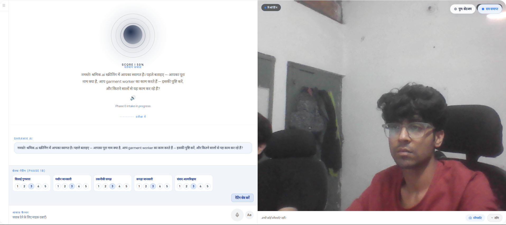
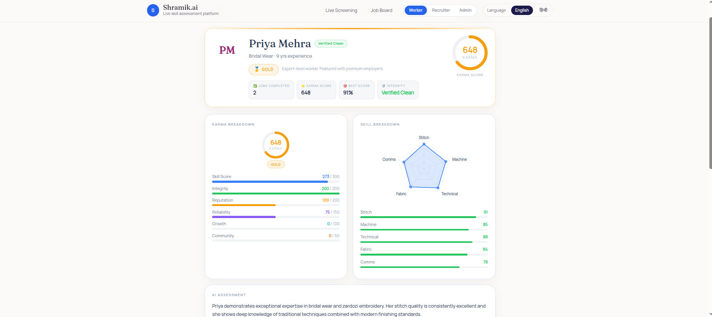
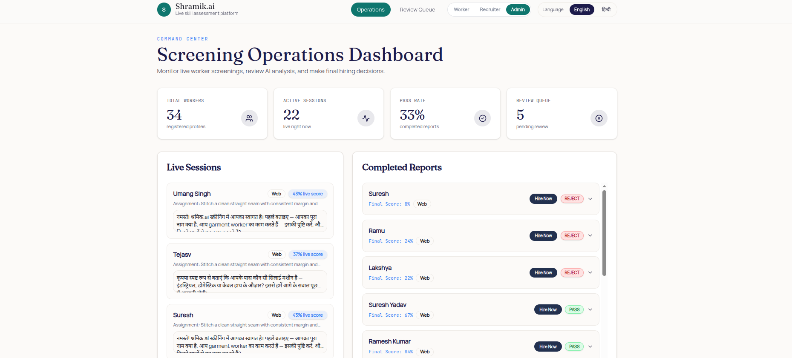
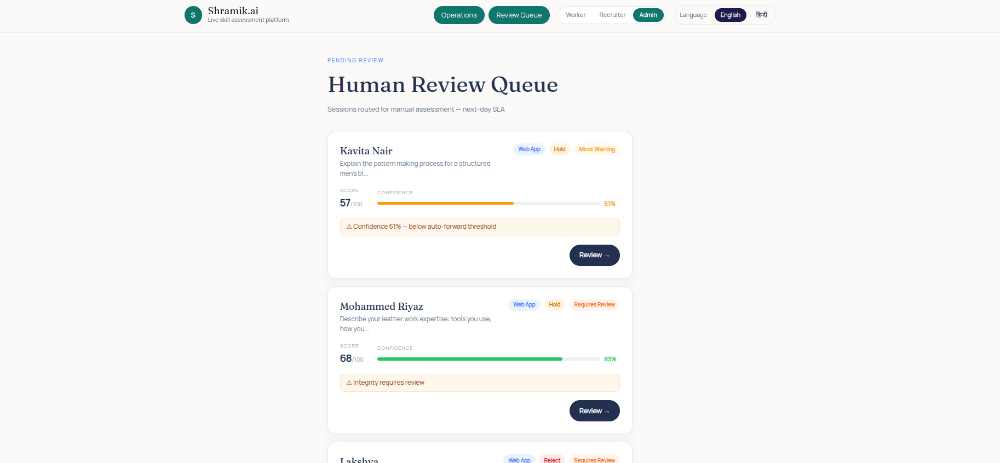

# Shramik.ai — Skills Verified. Middlemen Eliminated.

**AI-powered skill screening for India's 45 million informal garment workers**

[](https://azure.microsoft.com/en-us/products/ai-services/openai-service)
[](https://sarvam.ai)
[](https://mediapipe.dev)

**[Watch Demo](https://www.youtube.com/watch?v=XsCu-2khDyM)** · **[Live App](#)** · **[Architecture](#architecture)**

---

## The Problem

> *"Main 15 saal se silai kar raha hoon. Par koi proof nahi hai."*
> *("I've been stitching for 15 years. But I have no proof.")*

India's garment manufacturing sector employs **45 million workers** — the country's second-largest workforce. Nearly **90% of them are informal**: no verified credentials, no contracts, no skill records.

The hiring pipeline is broken on both sides:

| For Workers | For Recruiters |
|---|---|
| Skills invisible, wages suppressed | No way to verify candidates before hiring |
| **Thekadars** (labor brokers) take 15–20% off every paycheck | Days spent calling brokers with zero guarantees |
| One bad hire anywhere = unemployed | High turnover from mis-matched placements |
| No portable history across employers | Same candidate screened repeatedly from scratch |

**Shramik.ai eliminates the middleman entirely.**

---

## What We Built

A three-sided platform: workers get interviewed by AI, receive a portable Skill Passport, and connect directly to recruiters — no broker, no commission, no guesswork.

| For Workers | For Recruiters |
|---|---|
| Verified Skill Passport (QR-shareable) | Ranked candidates with rubric breakdowns |
| Karma score (0–1000) that compounds with every hire | Integrity flags + confidence bands on every result |
| Accessible via web, WhatsApp, or phone call | Human review queue for edge cases |
| Interview in Hindi, Hinglish, or English | Override AI decisions with audit trail |

---

## Demo

> **Add your demo video here** — embed a GIF or link to your recorded walkthrough

### Voice Onboarding — Hindi-First, Zero Friction


### Screening Room — Live AI Interview with Real-Time Proctoring


### Skill Passport — Portable, QR-Scannable Worker Identity


### Admin Dashboard — Recruiter View with Live Sessions & Reports


### Human Review Queue — Ethical AI with Oversight


---

## How It Works

```
Worker Registers → AI Interview (Hindi/English) → Evidence Collected → Karma Scored → Passport Issued → Recruiter Hires Direct
```

### Interview Phases

| Phase | What Happens |
|---|---|
| **Intro** | AI collects background: location, specialty, years of experience, tools available |
| **Technical** | 3–5 trade-specific questions tagged to rubric dimensions; live score updates per answer |
| **Task** | Worker uploads a photo of practical work (e.g., stitched seam); GPT-4o Vision grades it |
| **Passport** | Interview complete; Karma computed, Skill Passport generated in real time |

### Three Interview Channels

| Channel | Who It Serves | Proctoring |
|---|---|---|
| **Web app** | Workers with laptop/desktop | Full MediaPipe proctoring (face, gaze, hands) |
| **WhatsApp** | Workers with smartphones | Text + voice, no install needed |
| **Phone call (IVR)** | Rural workers with any phone, including Nokia | Voice-only via Sarvam TTS/STT |

**Language**: Hindi by default. Hinglish accepted. English fallback if the worker responds in English. The AI never switches language unprompted.

---

## Architecture


### Azure Services

| Service | Role in Shramik.ai |
|---|---|
| **Azure OpenAI GPT-4.1** | Conversational interview agent — asks questions, tags answers to rubric, assigns score delta per turn |
| **Azure OpenAI GPT-4o Vision** | Grades stitch quality from worker-uploaded photos (0–100), identifies defects |
| **Azure OpenAI GPT-4o** | Final transcript evaluator — scores all rubric dimensions after session completes |
| **Azure Database for PostgreSQL** | Async session, worker, and job storage (SQLAlchemy 2.0) |
| **Azure Blob Storage** | Work sample photos and portfolio media |
| **Sarvam AI saaras:v3** | Hindi speech-to-text for voice and IVR channels |
| **Sarvam AI bulbul:v2** | Hindi text-to-speech; generates natural audio responses for phone callers |
| **MediaPipe (browser)** | BlazeFace + HandLandmarker for real-time proctoring without server round-trips |

---

## AI Pipeline

This is not a chatbot with a scoring rubric bolted on. Every component of Shramik.ai was designed AI-first.

### 1. Multi-Modal Evidence Collection

A single score is built from four independent evidence streams:

```
Voice transcript  →  GPT-4.1 rubric scoring
Photo of work     →  GPT-4o Vision quality grade  ──→  Weighted blend  →  Karma
MediaPipe events  →  Integrity compliance score
Employer ratings  →  Reputation component
```

**Score blending formula:**
```
live_score   = clamp(live_score + score_delta, 0, 100)   # per conversational turn
final_score  = (live_score × 0.85) + (snapshot_score × 0.15)  # after photo upload
overall      = Σ(rubric_score × weight) × 0.94 + integrity_compliance × 0.06
```

### 2. Real-Time Conversational Scoring

GPT-4.1 evaluates each answer in real time, assigning a `score_delta` (-8 to +8) and tagging it to a rubric dimension:

| Score Delta | Meaning |
|---|---|
| +6 to +8 | Detailed, technically correct, specific answer |
| +3 to +5 | Adequate with some correct detail |
| +1 to +2 | Vague or partial |
| 0 | Off-topic or no real content |
| -2 to -4 | Wrong information or significant gap |
| -5 to -8 | Completely incorrect or evasive |

**Anti-inflation rule**: "Main machine chalata hoon" (I operate the machine) with no detail → 0 or negative. Vague answers are never rewarded.

**Rubric weights for garment workers:**

| Rubric Dimension | Weight |
|---|---|
| Stitch quality | 32% |
| Machine familiarity | 26% |
| Technical knowledge | 24% |
| Fabric & material knowledge | 12% |
| Communication & confidence | 6% |

### 3. Karma Engine (0–1000)

Every worker earns a Karma score built from six verifiable components:

| Component | Max Points | What It Measures |
|---|---|---|
| **Skill** | 300 | Weighted rubric average from best session, adjusted by channel |
| **Integrity** | 200 | Proctoring compliance across all sessions |
| **Reputation** | 200 | Employer star ratings after hire (real feedback loop) |
| **Reliability** | 150 | Session completion rate + improving score trend |
| **Growth** | 100 | Distinct rubric dimensions mastered across ALL sessions |
| **Community** | 50 | Referral network (active in next release) |

**Channel multipliers** — prevents gaming by doing 10 phone interviews:

| Interview Channel | Skill Multiplier |
|---|---|
| Web (full camera proctoring) | 1.00× |
| Web (no camera) | 0.85× |
| WhatsApp | 0.75× |
| Phone call (IVR) | 0.60× |

**Anomaly detection** — 4 automatic signals:

| Signal | Trigger | Penalty |
|---|---|---|
| Session burst | 4+ completions in 48 hours | −5% Karma |
| Rubric cloning | Identical scores across sessions within <1 pt | −5% Karma |
| Suspicious pairing | Critical integrity flag + score ≥ 80 | −5% Karma |
| Low variance | <4 std dev across 3+ sessions | −5% Karma |

Penalties stack (max −20%). Flags are stored for human audit — not auto-rejection.

**Tier assignment:**

```
Platinum  800–1000   Gold  600–799   Silver  300–599   Bronze  0–299
```

### 4. ML Cross-Validation (Gradient Boosted Tier Classifier)

The deterministic Karma engine is cross-validated by a trained ML model:

- **Architecture**: 120 weak learners, depth 4, learning rate 0.08
- **Features**: 18 dimensions including live score, rubric std deviation, acoustic confidence, response latency, answer length, face change flags, session count, mastered rubric dimensions, score trend
- **Blend**: `final_karma = (engine_karma × 0.85) + (model_karma × 0.15)`
- **Review trigger**: If ML tier ≠ engine tier AND confidence < threshold → auto-routed to human review queue

### 5. Real-Time Browser Proctoring (MediaPipe)

No server round-trip. Integrity runs entirely in the browser at 500ms intervals:

- **BlazeFace**: Detects face presence, multiple faces, face change
- **HandLandmarker**: Detects hand presence (flags phone use or cheating)

**Face signature** is built per worker from eye distance, bounding box aspect ratio, area, and normalized nose position. A weighted similarity score detects if a different person enters the frame:

```
face_change_score = 0.15×(eye_dist_diff) + 0.20×(aspect_ratio_diff) +
                   0.10×(area_diff)      + 0.30×(nose_x_diff) + 0.25×(nose_y_diff)
```

| Integrity Flag | Trigger | Effect |
|---|---|---|
| `clear` | No issues | integrity_score = 1.0 |
| `minor_warning` | Gaze/multiface events | integrity_score = 0.85 |
| `requires_review` | Session paused | integrity_score = 0.5 |
| `critical_flag` | Face change detected | integrity_score = 0.2, session paused, auto-flagged |

### 6. Human-in-the-Loop Review

Shramik.ai does not auto-reject. Borderline cases go to human reviewers:

- **Trigger**: Assessment confidence 55–79% OR any `requires_review` / `critical_flag` integrity result
- **What reviewers see**: Full transcript, per-turn scoring, rubric breakdown, integrity event log, ML vs engine agreement
- **Actions**: Override recommendation, edit individual rubric scores, add written reason (audit trail)
- **SLA**: Next-day review target

---

## Accessibility & Scale

Shramik.ai was designed for workers who have never used an AI product before.

- **Phone IVR**: A garment worker in rural Rajasthan with a basic phone dials in and interviews in Hindi. Same scoring pipeline, lower channel weight.
- **WhatsApp**: No app install. Workers already use it daily. Text or voice note responses accepted.
- **Hindi-first design**: Not translated from English. Built for Hindi speakers. Hinglish is natively supported.
- **Bilingual UI**: Language toggle persisted in `localStorage`; all 40+ UI strings available in English and Hindi.

**Scaling to new trades is a config change, not a code change.** The interview agent reads a domain config that specifies rubric dimensions, question banks, scoring weights, and assignment templates. Five trade domains are live today:

| Trade | Rubric Dimensions |
|---|---|
| Garment / Stitching | Stitch quality, machine familiarity, technical knowledge, fabric knowledge, communication |
| Electrician | Circuit knowledge, safety, tool familiarity |
| Carpentry | Joints, tools, precision, material knowledge |
| Beauty | Technique, product knowledge, hygiene |
| Food Service | Cooking, food safety, sanitation |

Adding a new trade requires adding a domain config block. The agent, scoring, Karma engine, and review queue all inherit it automatically.

---

## Tech Stack

| Layer | Technology |
|---|---|
| **Backend** | Python 3.11, FastAPI, SQLAlchemy 2.0 async, Uvicorn |
| **AI — Conversation** | Azure OpenAI GPT-4.1 (`2025-04-01-preview`) |
| **AI — Vision** | Azure OpenAI GPT-4o Vision |
| **AI — Speech** | Sarvam AI `saaras:v3` (STT) + `bulbul:v2` (TTS), `hi-IN` |
| **Proctoring** | MediaPipe BlazeFace + HandLandmarker (browser, WASM) |
| **ML Model** | Gradient Boosted Tier Classifier (18 features, 120 estimators) |
| **Frontend** | React 18, Tailwind CSS, shadcn/ui, React Router v6 |
| **Database** | SQLite (local dev) → Azure Database for PostgreSQL (prod) |
| **Storage** | Azure Blob Storage (work sample media) |
| **Phone / IVR** | Exotel (outbound + inbound call routing) |

---

## Running Locally

### Backend

```bash
cd backend
python -m venv .venv && source .venv/bin/activate
pip install -e .[dev]
uvicorn app.main:app --reload
```

Create `backend/.env`:

```env
API_AZURE_OPENAI_ENDPOINT=
API_AZURE_OPENAI_API_KEY=
API_AZURE_OPENAI_DEPLOYMENT=gpt-4.1
API_AZURE_OPENAI_API_VERSION=2025-04-01-preview
API_SARVAM_API_KEY=
```

API docs available at `http://localhost:8000/docs`.

### Frontend

```bash
cd frontend && npm install && npm start
```

Set `REACT_APP_BACKEND_URL=http://localhost:8000` in `frontend/.env.local`.

### Tests

```bash
cd backend && pytest
```

---

## Key API Endpoints

| Method | Path | Description |
|---|---|---|
| `POST` | `/api/sessions/start` | Start a screening session |
| `POST` | `/api/sessions/{id}/turn` | Submit worker response, receive AI question |
| `POST` | `/api/sessions/{id}/snapshot` | Upload practical work photo for vision scoring |
| `POST` | `/api/sessions/{id}/complete` | Finalize session, generate scorecard + Karma |
| `GET` | `/api/workers/{id}/karma` | Full Karma breakdown with anomaly signals |
| `GET` | `/api/passport/{id}` | Public Skill Passport (no auth required) |
| `GET` | `/api/review/queue` | Sessions pending human review |
| `POST` | `/api/review/{id}/decision` | Submit reviewer override decision |
| `POST` | `/api/jobs/{id}/hire` | Recruiter hires a worker directly |
| `POST` | `/api/jobs/{id}/rate` | Employer rates a worker post-hire |

---

## Team

| Contributor | Role |
|---|---|
| [Lakshya Shishir](https://github.com/lakshyashishir) | Backend lead — Azure OpenAI interview agent, Karma engine, ML scoring model, anomaly detection, jobs API, Azure PostgreSQL, admin dashboard |
| [Srija Bal](https://github.com/srijabal) | Frontend — worker profiles, portfolio viewer, hire modal, TTS/voice fixes, mobile-responsive screening UI |
| [Umang Singh](https://github.com/umangGG1) | Voice & telephony — Sarvam AI STT/TTS integration (speech.py), bilingual voice agent system prompt, ScreeningRoomPage audio pipeline, Twilio/IVR call routing, scoring logic |
| [Tejasv Bhalla](https://github.com/Tejasv-bhalla) | Full-stack — general labor screening path, labor pool scoring, demo flow (phase0, self-ratings, DB persistence), MediaPipe hand landmarks |
| [Bipasha BG](https://github.com/bipashabg) | UI/UX — Skill Passport component, voice onboarding endpoint, job board page, screening page design |
