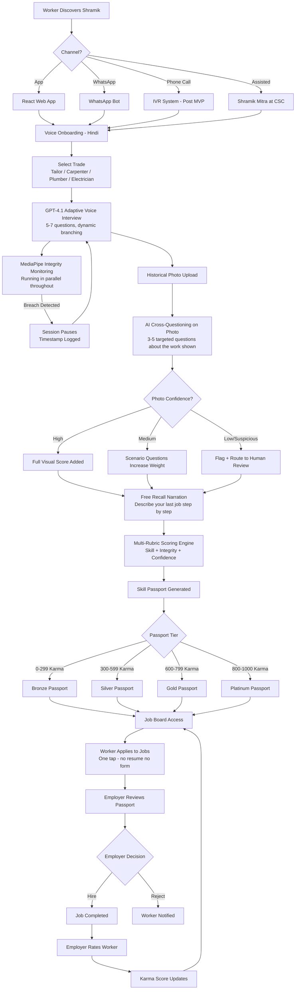
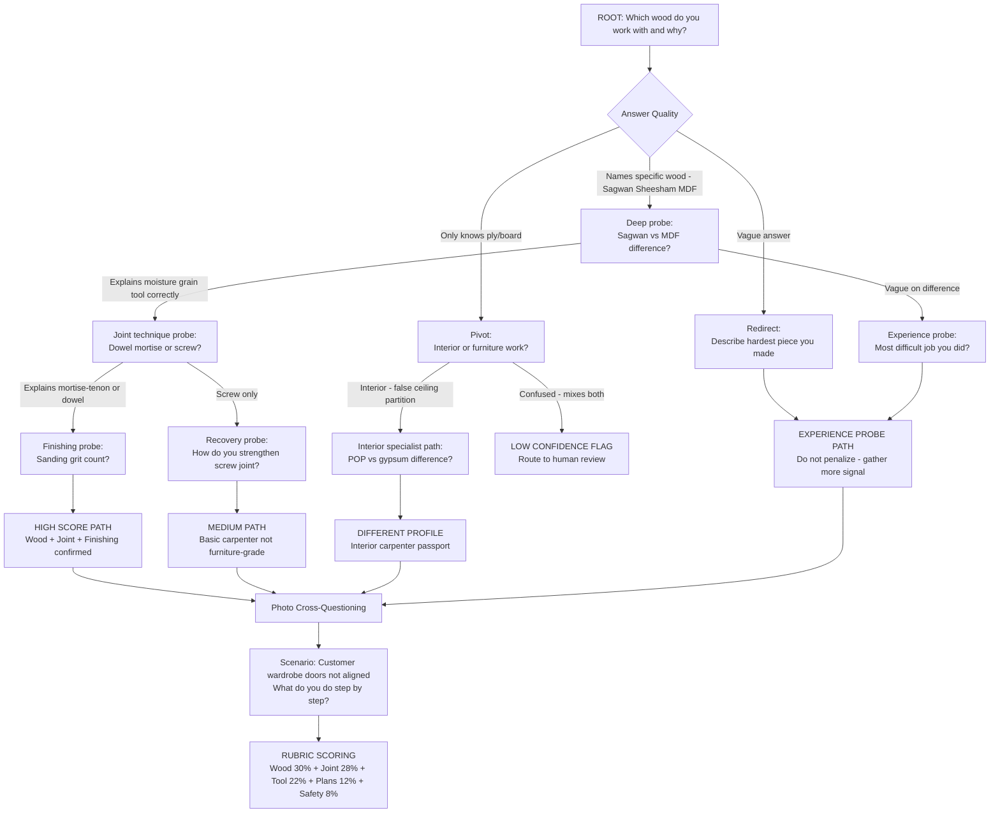
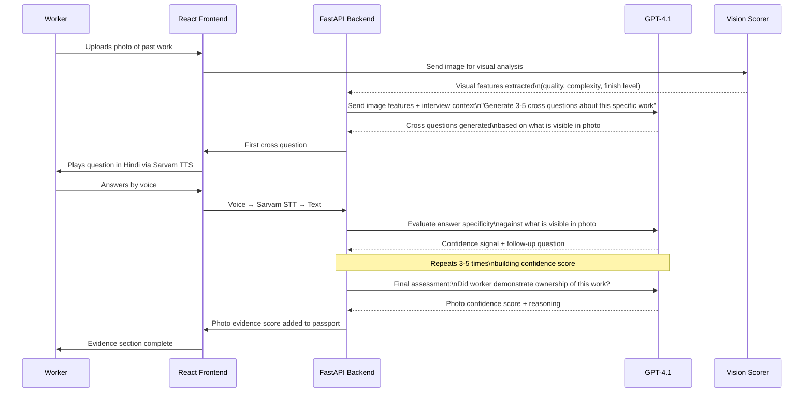
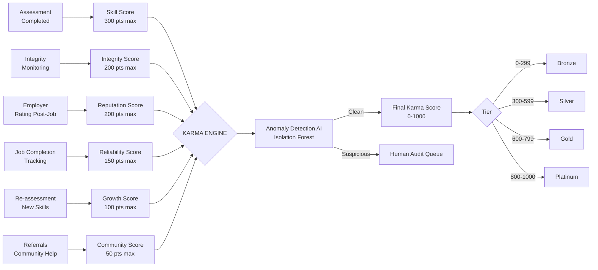
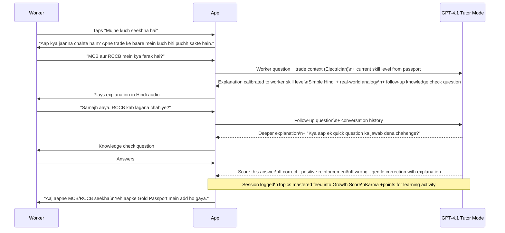
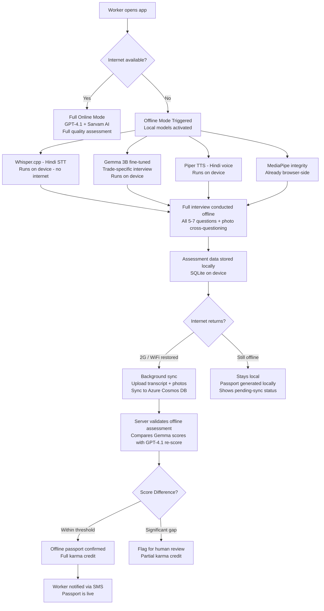

# SHRAMIK AI — Complete Product & Engineering Plan
### Team BitNova | Microsoft AI Unlocked Hackathon

---

## TABLE OF CONTENTS
1. [Problem Statement](#1-problem-statement)
2. [Who We Are Building For](#2-who-we-are-building-for)
3. [What Exists Today — And Why It Fails](#3-what-exists-today--and-why-it-fails)
4. [How We Solve It](#4-how-we-solve-it)
5. [X-Factors — Hackathon Wow Moments](#5-x-factors--hackathon-wow-moments)
6. [Architecture Overview](#6-architecture-overview)
7. [Flow & Sequence Diagrams](#7-flow--sequence-diagrams)
8. [Feature Deep-Dives](#8-feature-deep-dives)
9. [Phase-by-Phase Build Plan (GitHub Copilot Ready)](#9-phase-by-phase-build-plan-github-copilot-ready)
10. [Offline Capabilities](#10-offline-capabilities)
11. [Future Roadmap](#11-future-roadmap)

---

## 1. PROBLEM STATEMENT

India has **400+ million informal workers** — tailors, carpenters, plumbers, electricians, masons — who have real, valuable, often decade-long skills but **no formal proof of those skills.**

This creates a two-sided trust gap:

- **Workers** cannot prove their skill tier to premium employers, so they stay trapped in low-wage, contractor-mediated, exploitative hiring cycles.
- **Employers** cannot verify who is actually skilled before hiring, so they hire 5 to keep 2, lose money on bad placements, and never scale their workforce confidently.

The existing systems fail because they were built for literate, English-speaking, resume-carrying, formally educated workers. This describes **less than 10%** of India's actual workforce.

**The informal economy was designed to stay informal — and the people who lose most from that are the workers.**

---

## 2. WHO WE ARE BUILDING FOR

### Persona 1 — Ramu, 34 | Rural Tailor | Chandauli, UP
- Earns ₹6,000–8,000/month
- No personal smartphone, shares basic Android
- Speaks Bhojpuri/Hindi only
- 12 years of stitching experience, zero documentation
- Currently pays a labour contractor ₹500 to get placed, with no guarantee
- **What he loses without Shramik:** Permanently invisible to any employer outside his village

### Persona 2 — Salma, 27 | Semi-Urban Electrician | Bhopal outskirts
- Earns ₹12,000/month as wiring assistant
- Has smartphone, uses WhatsApp daily
- ITI certificate from a now-closed institute — unverifiable
- Gets passed over for ₹22,000/month roles because she can't prove her skill
- **What she loses without Shramik:** Her real skill never translates to real income

### Persona 3 — Deepak, 41 | Experienced Carpenter | Dharavi, Mumbai
- Earns ₹18,000–22,000/month, project to project
- Has worked for premium furniture brands informally
- Zero documentation of premium work history
- Loses high-value contracts to less skilled but better-connected candidates
- **What he loses without Shramik:** 12 years of premium skill experience = invisible to premium market

---

## 3. WHAT EXISTS TODAY — AND WHY IT FAILS

| Platform | What They Do | Why It Fails For Our Users |
|---|---|---|
| Apna / WorkIndia | Job listings for blue-collar | Zero verification. 60-70% no-show rate. Anyone claims anything. |
| Urban Company | Gig marketplace + training | Costs ₹3,000–8,000 to train. 25-30% commission. Urban only. |
| NSDC / PMKVY | Government certification | Batch-based, months-long, rampant certification fraud. |
| Quess / TeamLease | Staffing agencies | 20-30% margin taken. Opaque. No worker ownership. |
| LinkedIn | Professional profiles | Assumes keyboard, English, literacy, and resume. |

**The real incumbent is the thekedar (labour contractor).** They have a financial interest in keeping this system broken. Shramik directly disintermediates them.

**If Shramik disappeared tomorrow:**
- Workers go back to paying contractors for jobs they could access directly
- Employers go back to hiring 5 to keep 2
- The Skill Passport — the portable verified identity — disappears entirely. That is the irreplaceable thing.

---

## 4. HOW WE SOLVE IT

Shramik AI is a **multimodal skill verification platform** that issues a portable, AI-verified **Skill Passport** to informal workers — in their own language, on their own device, without requiring literacy.

### The 3-Evidence Framework

**Evidence 1 — Historical Photo + AI Cross-Questioning**
Worker uploads any photo of their past work. AI does NOT just score the photo visually. AI cross-questions the worker about the photo — testing their relationship with the work, not just the image quality.

> "We don't verify photos. We verify people through photos."

**Evidence 2 — Situational Scenario Assessment**
AI puts worker in a real trade scenario. How they think and respond reveals actual experience depth that cannot be faked without having lived through similar situations.

**Evidence 3 — Peer Verification (Karma tier upgrade)**
Worker provides one past employer's number. Automated 20-second WhatsApp or IVR call confirms the relationship. Binary signal feeds into Karma score.

### The Skill Passport
A portable, worker-owned, AI-verified credential that:
- Travels with the worker across every job and every employer
- Shows skill tier, rubric breakdown, integrity score, employer ratings
- Is readable by employers in seconds
- Gets stronger over time as the worker completes more jobs

---

## 5. X-FACTORS — HACKATHON WOW MOMENTS

These are the moments that will make judges stop and pay attention. Hit all of these in the demo.

---

### X-FACTOR 1 — "No Keyboard, Ever" (Stage: Onboarding)
**The moment:** Demo starts with a completely blank screen. Say: *"Watch — nothing gets typed in this entire demo."*
Worker says their name and trade in Hindi. Profile populates.
**Why it lands:** Judges immediately feel the accessibility gap closing. Every other platform they've seen starts with a form.

---

### X-FACTOR 2 — Live Question Adaptation (Stage: Voice Interview)
**The moment:** Worker mentions "overlock machine" in their answer. Next question immediately becomes about overlock tension and speed — not the generic next question.
Show the GPT-4.1 reasoning trace on a split screen if possible.
**Why it lands:** This proves the AI is reasoning, not scripting. It's the difference between a survey and an actual interview.

---

### X-FACTOR 3 — Photo Cross-Questioning (Stage: Evidence)
**The moment:** Worker uploads a photo of a fitted wardrobe. AI asks: *"Yeh jo upar wala corner joint hai — yeh kaise banaya?"* Worker answers with specific details. Show the confidence score update live.
**Why it lands:** Nobody else is doing this. Every competitor scores the image. You're scoring the person. This is the intellectual core of the product.

---

### X-FACTOR 4 — Integrity Breach Live (Stage: Monitoring)
**The moment:** During the demo interview, have a second person walk behind the worker. Session pauses automatically. Timestamp logged. Show the audit trail.
**Why it lands:** It's visceral and unexpected. Proctoring for blue-collar workers does not exist anywhere else. The judges will not have seen this before.

---

### X-FACTOR 5 — Two Passports Side by Side (Stage: Scoring)
**The moment:** Show a 12-year carpenter's passport next to a 2-year carpenter's passport. The rubric breakdown shows not just different scores but WHY — stitch quality evidence photo + specific transcript excerpts.
**Why it lands:** This is the employer value prop made visual. It answers "why would I trust this?" in 10 seconds.

---

### X-FACTOR 6 — The Worker Asks the Bot (Stage: Self-Learning Feature)
**The moment:** After assessment, worker taps "Mujhe kuch seekhna hai." Bot becomes a trade tutor. Worker asks: *"MCB aur RCCB mein kya farak hai?"* Bot explains in simple Hindi with an analogy.
**Why it lands:** Shramik is not just a hiring tool. It is the first knowledge companion these workers have ever had in their own language. This is the "aha" moment that makes it human.

---

### X-FACTOR 7 — Employer Karma Score (Stage: Recruiter Dashboard)
**The moment:** Show an employer profile with a 3.2/5 rating and tags like "Late payment" and "Misrepresented wage." Worker sees this before applying.
**Why it lands:** No platform in this space rates employers. Workers in the informal economy have zero protection from exploitative hirers. This flips the power dynamic visibly.

---

### X-FACTOR 8 — Karma Flywheel Explanation (Closing)
**The moment:** Show the loop: Assessment → Job → Rating → Karma rises → Better job → Re-assessment → Better model → Smarter assessment.
Say: *"Every interaction makes the system smarter. The data compounds. The moat deepens. No competitor can replicate this because the karma data is ours."*
**Why it lands:** Judges understand network effects. This shows you've thought beyond the MVP to a defensible platform.

---

## 6. ARCHITECTURE OVERVIEW

```
┌─────────────────────────────────────────────────────────┐
│                     FRONTEND LAYER                       │
│   React 18   |   Voice UI   |   Job Board   |   Dashboard│
│   WhatsApp Bot Interface    |   IVR Interface (Post-MVP) │
└─────────────────────┬───────────────────────────────────┘
                      │
┌─────────────────────▼───────────────────────────────────┐
│                     BACKEND LAYER                        │
│              FastAPI  |  Session Orchestration           │
│         Scoring Engine  |  Karma Engine  |  Reports      │
└──────┬──────────────┬──────────────────┬────────────────┘
       │              │                  │
┌──────▼──────┐ ┌─────▼──────┐ ┌────────▼───────┐
│  AI LAYER   │ │  VISION    │ │  INTEGRITY     │
│  Azure      │ │  LAYER     │ │  LAYER         │
│  GPT-4.1   │ │  Photo     │ │  MediaPipe     │
│  Sarvam STT│ │  Scoring   │ │  Face Detect   │
│  Sarvam TTS│ │  Cross-Q   │ │  Gaze Track    │
│  Gemma 3B  │ │  Generator │ │  Multi-face    │
│  (offline) │ │            │ │  Alert System  │
└─────────────┘ └────────────┘ └────────────────┘
       │
┌──────▼──────────────────────────────────────────────────┐
│                      DATA LAYER                          │
│   In-Memory (Demo)  →  Azure Cosmos DB (Production)      │
│   Azure Blob Storage (Photos/Recordings)                 │
│   Skill Passport Store  |  Karma Score Store             │
└─────────────────────────────────────────────────────────┘
```

### Technology Stack

| Layer | Technology | Purpose |
|---|---|---|
| Frontend | React 18 + Vite | Main web app |
| Voice UI | Sarvam AI STT/TTS | Hindi voice input/output |
| Interview AI | Azure OpenAI GPT-4.1 | Adaptive questioning |
| Integrity | MediaPipe (browser) | Face/gaze monitoring |
| Backend | FastAPI (Python) | API orchestration |
| Offline LLM | Gemma 3B quantized (GGUF) | On-device assessment |
| Offline STT | Whisper.cpp (Hindi small) | On-device speech |
| Database | In-Memory → Azure Cosmos DB | Worker/employer data |
| Storage | Azure Blob Storage | Photos, transcripts |
| Hosting | Azure Container Apps | Production deployment |

---

## 7. FLOW & SEQUENCE DIAGRAMS

### 7.1 — Complete Worker Journey



---

### 7.2 — GPT-4.1 Interview Branching (Carpenter Example)



---

### 7.3 — Photo Cross-Questioning Sequence



---

### 7.4 — Karma Score Architecture



---

### 7.5 — Worker Self-Learning Bot Flow



---

### 7.6 — Offline Assessment Flow



---

## 8. FEATURE DEEP-DIVES

### 8.1 — The Self-Learning Bot ("Apna Ustaad")

This feature transforms Shramik from a hiring tool into a **lifetime career companion.**

**What it does:**
After assessment, workers can ask the AI any question about their trade in natural Hindi (or any dialect). The bot answers at the worker's knowledge level — calibrated from their passport score — and tracks what they learn.

**Why it matters for the hackathon:**
Every other feature serves employers. This feature serves only the worker. It creates emotional connection to the product that no competitor has. It is the feature that makes workers tell other workers about Shramik.

**The knowledge check loop:**
After explaining a concept, bot asks a simple question to verify understanding. Correct answer → Knowledge tag added to passport. Repeated correct answers over time → Growth score increases → Karma rises → Better job recommendations.

**Example sessions by trade:**

*Carpenter*
> Worker: "Laminate aur veneer mein kya farak hai?"
> Bot: "Laminate synthetic hai — plastic jaisi layer hoti hai. Veneer asli lakdi ka patla tukda hota hai. Laminate sasta aur zyada durable hai office furniture ke liye. Veneer mehenga dikhta hai premium furniture mein. Ek sawaal — ek customer premium bedroom furniture maang raha hai, aap kaunsa choose karoge?"

*Plumber*
> Worker: "Water hammer kya hota hai?"
> Bot: "Jab pipe mein paani achanak band hota hai toh ek jhatka aata hai — woh dhang ki awaaz hoti hai. Isko water hammer kehte hain. Isse pipe loose ho jaati hai ya fitting toot sakti hai. Fix karne ke liye air chamber ya pressure reducing valve lagaate hain. Kya aapke kisi kaam mein yeh problem aayi hai kabhi?"

**Copilot implementation note:**
Prompt for this feature:
*"Build a React component 'TradeKnowledgeBot' that takes workerProfile (trade, karmaScore, knowledgeTags) as props, maintains conversation history in useState, calls the Anthropic API with a system prompt calibrated to the worker's skill level, plays responses via Sarvam TTS, and after each explanation generates a knowledge check question. On correct answer, calls PATCH /api/worker/:id/knowledge-tags to add the topic."*

---

### 8.2 — Question Trees by Trade (Seed Data for GPT-4.1)

These are fed as structured system prompts. GPT-4.1 uses them as a branching guide but adapts dynamically.

**CARPENTER**
```
Rubrics: Wood Knowledge 30% | Joint & Finishing 28% | 
         Tool Mastery 22% | Reading Plans 12% | Safety 8%

Root Q: "Aap kaunsi lakdi pe kaam karte ho aur kyun?"
Branch A (names specific wood): → "Sagwan aur MDF mein kya farak hai?"
  Branch A1 (explains correctly): → "Joint technique — dowel, mortise, ya screw?"
    Branch A1a (explains mortise): → "Finishing mein sanding ke kitne grit use karte ho?"
    Branch A1b (screw only): → "Screw joint ko strong kaise karte ho?"
  Branch A2 (vague): → "Aapne kya-kya furniture banaya? Sabse mushkil kya tha?"
Branch B (only ply/board): → "Interior karte ho ya furniture?"

Photo cross-Q: "Yeh joint kaise banaya? Kaun sa wood hai? Kitna time laga? 
               Koi mushkil aayi thi?"
Scenario: "Customer wardrobe ke darwaze tede hain — kya karoge step by step?"
Fraud signals: Can't name wood visible in photo | Wrong finish type | 
               Impossible timeline for complexity shown
```

**PLUMBER**
```
Rubrics: Pipe Knowledge 28% | Fitting & Jointing 26% | 
         Pressure & Flow 22% | Sanitation Systems 14% | Safety 10%

Root Q: "Nayi building plumbing lagana ya purani pipe repair — kaunsa kaam zyada?"
Branch A (new installation): → "CPVC aur GI pipe — kab kaunsa use karte ho?"
  Branch A1 (knows correctly): → "Water pressure kam ho toh pehle kya check karoge?"
    Branch A1a (systematic check): → "Overhead tank connection aur float valve explain karo"
    Branch A1b (vague): → "Agar borewell pump hai toh pressure tank ka kaam?"
  Branch A2 (doesn't know): → "Aap kya use kiya hai — PVC? PPR?"
Branch B (repair only): → "Leaking tap — washer change ya pura valve?"

Photo cross-Q: "Yeh kaunsa connection hai? Kaunsa sealant use kiya? 
               Pressure test kiya tha? CPVC hai ya PPR?"
Scenario: "Raat 11 baje customer ka pipe burst — pehle unhe kya bologe karne ko?"
Scenario 2: "Bathroom floor drain block, paani nahi ja raha — step by step kya karoge?"
Fraud signals: Can't identify pipe material in their own photo | 
               No mention of pressure testing | Wrong location context
```

**ELECTRICIAN**
```
Rubrics: Wiring Knowledge 30% | Safety Compliance 25% | 
         Fault Diagnosis 22% | Load Calculation 13% | Tool Handling 10%

Root Q: "House wiring, industrial, ya maintenance — kaunsa kaam karte ho?"
Branch A (house wiring): → "2BHK mein kitne circuits banate ho aur kyun alag-alag?"
  Branch A1 (separates AC kitchen lighting): → "Earth wire kaise verify karte ho?"
    Branch A1a (knows earth tester): → "MCB aur RCCB mein kya farak hai?"
      A1a-i (explains correctly): → HIGH SCORE PATH
      A1a-ii (only MCB): → "RCCB kab lagana zaroori hota hai?"
    Branch A1b (contractor karta hai): → FLAG safety gap
  Branch A2 (lights aur fans only): → "Switch board mein phase neutral earth wire?"
Branch B (industrial): → "3-phase motor DOL starter connection sequence?"

MANDATORY SAFETY SCENARIO (all branches — non-negotiable):
"Kaam karte waqt wire se spark aaya — aap kya karoge step by step?"
Expected sequence: 1) MCB off 2) Don't touch bare wire 3) Test with tester 4) Report
Any answer skipping step 1 = automatic safety flag regardless of other scores

Photo cross-Q: "Yeh residential ya commercial hai? Kitne circuits? 
               MCB kaunse ampere ka? Earthing wire kahaan gayi?"
Fraud signals: Can't read specs in their own photo | Wrong installation type | 
               Safety scenario answer wrong
```

---

### 8.3 — Karma Score Engine

```python
# Pseudocode for Karma Engine — feed to GitHub Copilot

class KarmaEngine:
    WEIGHTS = {
        'skill_score': 0.30,        # 300 pts — from rubric assessment
        'integrity_score': 0.20,    # 200 pts — from MediaPipe sessions
        'reputation_score': 0.20,   # 200 pts — from employer ratings
        'reliability_score': 0.15,  # 150 pts — job completion rate
        'growth_score': 0.10,       # 100 pts — re-assessments + learning
        'community_score': 0.05,    # 50 pts  — referrals + contributions
    }
    
    ASSESSMENT_TIER_MULTIPLIER = {
        'ivr_basic': 0.6,       # Phone-based IVR assessment
        'whatsapp': 0.75,       # WhatsApp bot assessment
        'app_standard': 0.85,   # App without camera
        'app_full': 1.0,        # Full multimodal assessment
    }
    
    ANOMALY_SIGNALS = [
        '5_stars_from_10_employers_in_7_days',
        'multiple_accounts_same_device',
        'employer_and_worker_created_same_day',
        'karma_jump_over_200_in_48_hours',
        'all_ratings_exactly_5_from_same_ip_range',
    ]
    
    def compute_karma(worker_id) -> int:
        # Fetch all components
        # Apply tier multiplier to skill score
        # Run anomaly detection
        # Return final score 0-1000
        pass
    
    def get_passport_tier(karma_score) -> str:
        if karma_score >= 800: return 'Platinum'
        elif karma_score >= 600: return 'Gold'  
        elif karma_score >= 300: return 'Silver'
        else: return 'Bronze'
    
    def generate_passport_narrative(worker_data) -> str:
        # Call GPT-4.1 with structured worker data
        # Returns human-readable Hindi + English summary
        # "Ramesh is a Gold-tier carpenter with 12 years experience..."
        pass
```

---

## 9. PHASE-BY-PHASE BUILD PLAN (GITHUB COPILOT READY)

Each phase has a Copilot prompt you can use directly. Assume 2-3 developers working in parallel with Copilot assistance.

---

### PHASE 0 — Project Setup (Day 1, 2 hours)

**Goal:** Monorepo, both services running, basic routing done.

**Copilot Prompt:**
```
Create a monorepo with two services:
1. /frontend — React 18 + Vite + TailwindCSS + shadcn/ui. 
   Main routes: /worker (assessment flow), /jobs (job board), 
   /recruiter (dashboard), /passport/:id (public passport view).
   
2. /backend — FastAPI (Python 3.11). 
   Main routers: /api/worker, /api/employer, /api/assessment, 
   /api/passport, /api/karma.
   In-memory data store using Python dict for demo.
   CORS configured for localhost:5173.
   
Add .env.example with: AZURE_OPENAI_KEY, AZURE_OPENAI_ENDPOINT, 
SARVAM_API_KEY, AZURE_OPENAI_DEPLOYMENT_NAME.

Add a basic health check endpoint GET /health returning 
{"status": "ok", "version": "1.0.0"}.
```

---

### PHASE 1 — Voice Onboarding (Day 1, 3 hours)

**Goal:** Worker can speak their name and trade in Hindi, profile is created.

**Copilot Prompt:**
```
Build a VoiceOnboarding React component:

1. On mount, play a Hindi welcome message using Sarvam AI TTS API.
   POST https://api.sarvam.ai/text-to-speech
   Body: {text: "Namaste! Main aapka Shramik Mitra hun...", 
          target_language_code: "hi-IN", speaker: "meera"}
   
2. After welcome, show a pulsing microphone button.
   On click, start recording using MediaRecorder API.
   On stop, send audio blob to Sarvam AI STT:
   POST https://api.sarvam.ai/speech-to-text
   Return: transcribed Hindi text.
   
3. Send transcript to backend POST /api/worker/onboard
   Extract: worker name, trade, years of experience using 
   GPT-4.1 with system prompt:
   "Extract name, trade (tailor/carpenter/plumber/electrician), 
    and years_of_experience from this Hindi text. 
    Return JSON only."
   
4. Create worker profile in in-memory store.
   Return worker_id.
   
5. Confirm back to worker in Hindi voice: 
   "Aapka naam [name] register ho gaya. Aap [trade] ka interview 
    denge. Kya aap taiyaar hain?"
   
Show zero text input fields throughout. Everything is voice.
```

---

### PHASE 2 — Adaptive Interview Engine (Day 1-2, 5 hours)

**Goal:** GPT-4.1 conducts a dynamic 5-7 question interview, adapting to each answer.

**Copilot Prompt:**
```
Build the Interview Engine:

Backend: POST /api/assessment/next-question
Input: {worker_id, trade, conversation_history: [], current_rubric_scores: {}}
Output: {question_hindi: string, question_english: string, 
         rubric_being_assessed: string, phase: string, 
         is_final: boolean}

System prompt for GPT-4.1:
"You are Shramik AI, conducting a skill assessment interview 
 for an informal worker in India. 
 
 Trade: {trade}
 Current conversation: {history}
 Rubrics to assess: {rubric_weights}
 Questions asked so far: {count}
 
 Rules:
 - Ask ONE question at a time in simple Hindi
 - Adapt your next question based on the quality of the last answer
 - If answer shows expertise, go deeper on that rubric
 - If answer is vague, try a different approach or scenario
 - After 5-7 questions, return is_final: true
 - Track which rubrics you have enough signal for
 - Never ask the same rubric twice if already well-assessed
 - Output valid JSON only matching the output schema above"

Frontend: InterviewRoom component
- Shows current phase indicator (Onboarding / Technical / Scenario / Wrap-up)
- Plays each question via Sarvam TTS
- Records answer via MediaRecorder
- Sends to Sarvam STT → gets transcript
- Sends transcript to /api/assessment/next-question
- Shows live rubric confidence bars updating after each answer
- Shows conversation transcript in Hindi on screen
- When is_final: true, moves to photo evidence stage
```

---

### PHASE 3 — MediaPipe Integrity Monitoring (Day 2, 3 hours)

**Goal:** Real-time face detection, multi-face alert, gaze deviation — runs in browser.

**Copilot Prompt:**
```
Build IntegrityMonitor React component using MediaPipe FaceMesh:

1. Import MediaPipe FaceMesh from CDN:
   @mediapipe/face_mesh and @mediapipe/camera_utils

2. Run at 30fps in background during interview (invisible to worker)

3. Detect and log these events with timestamps:
   - NO_FACE: worker's face not visible for 3+ seconds
   - MULTIPLE_FACES: more than one face detected  
   - GAZE_LEFT: gaze deviated significantly left (reading notes)
   - GAZE_RIGHT: gaze deviated significantly right
   - GAZE_DOWN: looking down consistently

4. On NO_FACE or MULTIPLE_FACES: 
   - Pause interview immediately
   - Show overlay: "Aapka chehra nahi dikh raha. 
     Kripya camera ke saamne baithe."
   - Play this message via Sarvam TTS
   - Log event: POST /api/assessment/integrity-event
     {worker_id, event_type, timestamp, session_id}
   - Resume when face returns

5. GAZE events: log silently, do not pause

6. At end of session, generate integrity report:
   {total_events: 0, clean_session: true, 
    event_log: [], integrity_score: 0-100}
    
Show a small green dot indicator to worker 
("Camera active") but don't show them their integrity score.
```

---

### PHASE 4 — Photo Evidence + Cross-Questioning (Day 2, 4 hours)

**Goal:** Worker uploads photo, AI cross-questions them about it, generates confidence score.

**Copilot Prompt:**
```
Build PhotoEvidence component and cross-questioning flow:

1. Photo upload UI:
   "Apne kisi bhi purane kaam ki photo bhejiye. 
    WhatsApp pe padi photo bhi chalegi."
   Accept: image/jpeg, image/png, image/webp. Max 10MB.
   
2. On upload, send to backend POST /api/assessment/analyze-photo
   - Convert to base64
   - Send to GPT-4.1 Vision with prompt:
     "You are assessing a {trade} worker's submitted work photo.
      Analyze the image and generate 4 cross-questioning questions 
      in Hindi that ONLY someone who made this specific work could 
      answer correctly. Questions should ask about:
      1. A specific detail visible in the photo
      2. The process/technique used for something visible
      3. A problem they might have encountered making this
      4. What they would do differently now
      Return JSON: {questions: [], visual_quality_score: 0-100, 
                   work_complexity: 'basic|intermediate|advanced',
                   observed_features: []}"

3. For each cross-question:
   - Play via Sarvam TTS
   - Record answer via MediaRecorder → STT → transcript
   - Send to GPT-4.1: evaluate answer specificity and authenticity
     "Given this photo of a {trade} worker's work showing {observed_features},
      the worker answered: '{answer}' to the question '{question}'.
      Score their answer 0-100 for:
      - specificity (did they mention concrete details?)
      - consistency with what's visible in the photo
      - plausibility (does timeline/process make sense?)
      Return JSON: {score: 0-100, confidence_signal: 'high|medium|low|suspicious',
                   reasoning: string}"

4. After all 4 questions, compute photo_confidence_score (weighted average)
   Map to: 
   - 75-100: HIGH_CONFIDENCE (worker almost certainly made this)
   - 50-74: MEDIUM_CONFIDENCE
   - 25-49: LOW_CONFIDENCE (flag for human review)
   - 0-24: SUSPICIOUS_FLAG (route to human review queue)

5. Show worker: "Photo evidence complete." 
   Do NOT show them their score.
```

---

### PHASE 5 — Free Recall Narration (Day 2, 1 hour)

**Goal:** Worker describes their last job freely. AI scores specificity and authenticity.

**Copilot Prompt:**
```
Build FreeRecall component:

1. Prompt worker in Hindi (voice):
   "Ab mujhe batao — aapne recently jo kaam kiya, 
    woh describe karo. Kahan tha, kya karna tha, 
    kaise kiya, koi problem aayi thi kya? 
    Apne words mein batao, koi jaldi nahi."

2. Record open-ended voice response (up to 3 minutes)
   Show live transcription on screen as they speak.

3. Send transcript to POST /api/assessment/score-recall
   GPT-4.1 prompt:
   "A {trade} worker with claimed {years} years experience 
    gave this free recall of their recent work: '{transcript}'
    
    Score the following (0-100 each):
    - specificity: mentions of specific materials, tools, measurements
    - procedural_depth: describes logical sequence of steps
    - problem_solving: mentions challenges and how they were handled
    - trade_vocabulary: uses correct technical terms naturally
    - consistency: aligns with their earlier interview answers
    
    Also extract: job_type, location_context, estimated_complexity
    Return JSON only."

4. This score feeds into the Skill Score component of Karma.
   High specificity + procedural depth = strong signal of real experience.
```

---

### PHASE 6 — Rubric Scoring + Skill Passport Generation (Day 3, 3 hours)

**Goal:** All signals combined into final rubric scores, passport generated with narrative.

**Copilot Prompt:**
```
Build ScoringEngine and PassportGenerator:

Backend: POST /api/assessment/finalize
Input: {worker_id, session_id}
Collects: interview_rubric_scores, photo_confidence_score, 
          free_recall_score, integrity_score

Scoring Logic:
CARPENTER: 
  wood_knowledge = interview_scores.wood * 0.30
  joint_finishing = (interview_scores.joint * 0.5 + 
                     photo_confidence * 0.5) * 0.28
  tool_mastery = interview_scores.tools * 0.22
  reading_plans = interview_scores.plans * 0.12
  safety = interview_scores.safety * 0.08
  final_skill_score = sum(above) * assessment_tier_multiplier

(Similar for Plumber, Electrician, Tailor)

Initial Karma = skill_score * 300 + integrity_score * 200
(reputation, reliability, growth, community = 0 at first assessment)

Generate Passport Narrative via GPT-4.1:
"Generate a professional 3-sentence Skill Passport summary 
 in English and Hindi for this worker:
 Name: {name}, Trade: {trade}, Experience: {years},
 Top rubric: {best_rubric}, Score: {score}, 
 Employer ratings: {ratings}, Integrity: {clean/flagged}
 
 Tone: professional, factual, respectful. 
 Like a recommendation letter, not a report card."

Store passport in /api/passport/:id (publicly accessible)
Generate shareable URL with QR code.

Frontend: PassportCard component
Shows: Worker photo | Name | Trade | Tier badge | 
       Rubric radar chart | Narrative | QR code | 
       Integrity status | Karma score
Animate: Tier badge reveal (Bronze → Silver → Gold → Platinum)
This should feel like receiving a degree certificate.
```

---

### PHASE 7 — Job Board (Day 3, 2 hours)

**Goal:** Worker sees filtered jobs. Employer posts in 5 fields. One-tap apply.

**Copilot Prompt:**
```
Build zero-commission Job Board:

Employer POST /api/jobs — requires only 5 fields:
{trade, location, wage_range, duration, min_passport_tier}

Worker GET /api/jobs — auto-filtered by:
  - Their trade
  - Their passport tier >= job minimum
  - Within 50km of their registered location
  - Sorted by: wage match score + job freshness

Job Card shows: Trade | Location | Wage | Duration | 
               Employer karma score | Days posted

Worker applies: POST /api/jobs/:id/apply
  - No resume, no form
  - Sends their passport ID automatically
  - Employer gets notification with passport link

Employer dashboard shows applied workers as:
  Passport card preview | Match score | Quick actions: 
  Shortlist / Message / Reject

Add employer karma score display on every job listing.
Show workers: "Is employer ko 847 workers ne 4.2/5 diya hai"
```

---

### PHASE 8 — Self-Learning Bot "Apna Ustaad" (Day 3, 2 hours)

**Goal:** Worker can ask their AI anything about their trade in Hindi.

**Copilot Prompt:**
```
Build TradeKnowledgeBot component:

1. Accessible from passport page: "Apne trade ke baare mein 
   kuch bhi puchho" button.

2. Voice-first chat interface:
   - Worker speaks question in Hindi
   - Sarvam STT converts to text
   - Send to POST /api/bot/ask with:
     {question, worker_trade, worker_karma_score, 
      knowledge_tags_already_earned: [], conversation_history: []}

3. GPT-4.1 system prompt:
   "You are Apna Ustaad (My Teacher), a friendly trade knowledge 
    assistant for informal workers in India.
    
    Worker's trade: {trade}
    Worker's skill level: {karma_score}/1000 ({tier})
    Topics they already know: {knowledge_tags}
    
    Rules:
    - Answer in simple Hindi using everyday language
    - Use real-world analogies from Indian life
    - Calibrate complexity to their skill level
    - After explaining, ask ONE follow-up check question
    - If they answer correctly, confirm and offer to go deeper
    - If wrong, gently correct with explanation
    - Keep responses under 4 sentences unless they ask for more
    - Never make them feel bad for not knowing something"

4. After correct knowledge check answer:
   PATCH /api/worker/:id/knowledge-tags 
   Add topic to earned tags.
   Update Growth Score (+2 karma points per topic mastered).
   
5. Show progress: "Aaj aapne {topic} seekha. 
   Aapka Karma score {old} se {new} ho gaya."

6. Show cumulative learning: "Is hafte aapne 5 naye topics seekhe."
```

---

### PHASE 9 — Recruiter Dashboard (Day 4, 3 hours)

**Goal:** Full recruiter view with Pass/Hold/Reject, override tracking, employer karma.

**Copilot Prompt:**
```
Build RecruiterDashboard:

1. Candidate list with filters:
   - By trade | By tier | By location | By karma range
   - Sort by: best match | newest | highest karma

2. Candidate card shows:
   - Passport summary card (reuse PassportCard component)
   - Match percentage for open role (computed by API)
   - Rubric radar chart
   - Integrity status badge
   - Full transcript expandable
   - Photo evidence with AI confidence score

3. One-click decision buttons: Pass | Hold | Reject
   On decision: POST /api/review/decision
   {candidate_id, job_id, recruiter_id, 
    decision, override_reason (if differs from AI recommendation)}
   
   Track: AI recommended X, human chose Y — this is training data.

4. After hiring and job completion:
   Employer rates worker: 1-5 stars + tags
   Worker rates employer: 1-5 stars + tags
   Both feed into respective karma scores.

5. Employer karma display:
   "Yeh employer 847 workers ne hire kiya hai. 
    Average rating: 4.2/5. 
    Common tags: On-time payment, Good conditions."
    
   Red flag employers get banner: 
   "Caution: Multiple workers reported wage mismatch."
```

---

### PHASE 10 — Polish, Demo Script, Edge Cases (Day 4, 2 hours)

**Copilot Prompt:**
```
Polish checklist:

1. Add loading states to all API calls with Hindi messages:
   "Aapka jawab sun raha hun..." (processing voice)
   "Aapki photo dekh raha hun..." (analyzing photo)
   "Aapka Passport bana raha hun..." (generating passport)

2. Add graceful degradation:
   - If Sarvam STT fails: show text input fallback with message
     "Voice kaam nahi kar raha. Yahan type karein."
   - If GPT-4.1 times out: retry once, then use cached question
   - If photo upload fails: allow retry 3 times with clear message

3. Add demo mode toggle (for hackathon):
   - Pre-filled worker persona (Ramu, tailor, 12 years)
   - Fast-forward interview to show X-factor moments
   - Side-by-side passport comparison (12-year vs 2-year)
   - Pre-trigger integrity breach for demo

4. Add employer karma red flag demo case:
   One employer in demo data with 2.1/5 rating and 
   "Late payment" "Wage mismatch" tags for visual impact.

5. Ensure all voice interactions have text captions 
   for judges who may not understand Hindi.
```

---

## 10. OFFLINE CAPABILITIES

### What's Hard About On-Device LLM (Be Honest in Pitch)

The on-device model is a strong differentiator but has real constraints:

| Constraint | Reality | Mitigation |
|---|---|---|
| Model size | Gemma 3B quantized = ~500MB download | Download once on WiFi. Show progress bar. |
| Reasoning quality | Gemma 3B vs GPT-4.1 = noticeable gap on complex answers | Fine-tune on trade-specific data only. Narrow domain = smaller gap. |
| Hindi quality | Smaller models have weaker Hindi than Sarvam | Use Whisper.cpp for STT which has good Hindi. Gemma for reasoning only. |
| First-run latency | Model load on budget Android = 8-15 seconds | Show loading screen with tips. "Pehli baar thoda time lagega." |
| RAM requirement | Needs 2GB+ free RAM | Minimum device spec: Android 8.0+ with 3GB RAM. Show incompatible device message. |

**Pitch framing:** *"We are the only assessment platform that works with zero internet. For rural India, this is not a feature — it is the product."*

### Offline Passport Tiers

```
ONLINE assessment   → Full karma credit (1.0x multiplier)
OFFLINE with sync   → 90% karma credit (0.9x multiplier)  
IVR call only       → 60% karma credit (0.6x multiplier)
WhatsApp bot        → 75% karma credit (0.75x multiplier)
```

Employers see which tier was used. Workers are incentivized to upgrade.

---

## 11. FUTURE ROADMAP

### POST-HACKATHON (Month 1-2)

- IVR calling system via Exotel (server-side GPT-4.1, same model, phone frontend)
- WhatsApp Business API bot integration (via Gupshup or direct Meta API)
- Azure Cosmos DB + Blob Storage migration from in-memory
- Shramik Mitra onboarding flow (community agent assisted assessment)
- Offline Gemma 3B fine-tuning on tailor + carpenter data

### PHASE 2 — SCALE (Month 3-6)

- Expand to 8 trades: Mason, Painter, Welder, AC Technician, Cook, Driver
- Android native app (React Native) for better offline performance
- Peer verification flow (automated WhatsApp call to references)
- Employer subscription model launch (₹499/month)
- Pilot with 3 garment factories in Surat or Tiruppur

### PHASE 3 — PLATFORM (Month 6-12)

- Gig worker mode (Type B — project-based with ongoing ratings)
- Migrant worker flow (cross-state passport validity)
- Karma decay + re-assessment nudges
- Premium training partnerships (link assessment gaps to relevant courses)
- NSDC partnership for government-recognized digital credential layer
- Wage benchmarking AI ("Workers with your profile earn ₹X–Y in your city")

### PHASE 4 — MOAT (Year 2)

- Data licensing to vocational training companies (anonymized, aggregated)
- API for ATS integration (large employers embed Shramik verification)
- Equipment manufacturer partnerships (Bosch, Stanley — skill-linked tool training)
- Multilingual expansion: Tamil, Telugu, Marathi, Bengali voice models
- Micro-insurance linkage (verified workers get access to PMSBY/PMJJBY faster)
- On-device model trained on 1M+ Shramik assessments (proprietary, defensible)

---

## THE ONE-SLIDE SUMMARY

```
PROBLEM:   400M informal workers. Real skills. No proof.
           Employers can't verify. Workers stay invisible.

SOLUTION:  Voice-first AI assessment in Hindi.
           Multimodal verification without literacy.
           Portable Skill Passport that travels with the worker.

HOW:       GPT-4.1 adaptive interview → Photo cross-questioning 
           → Scenario assessment → MediaPipe integrity 
           → Karma score → Skill Passport

X-FACTOR:  1. We verify people through photos, not photos themselves
           2. Integrity monitoring for blue-collar — first ever
           3. Employer karma score — workers rate exploitative employers
           4. Apna Ustaad — lifetime AI trade knowledge companion
           5. Offline-first — works with zero internet
           6. Karma flywheel — every interaction makes the model smarter

MOAT:      The karma data compounds.
           The model gets smarter from every worker and every employer.
           No competitor can replicate 3 years of karma data.

PITCH LINE: "Every other platform serves employers who want to hire better.
             Shramik gives workers something they own — a verified identity 
             that makes them unmissable to the right employers 
             and protected from the wrong ones."
```

---

*Document version 1.0 | Team BitNova | Shramik AI*
*Built for Microsoft AI Unlocked Hackathon*
*Architecture assumes GitHub Copilot-assisted development*
*Estimated build time with 2 devs + Copilot: 4 days for demo-ready prototype*
